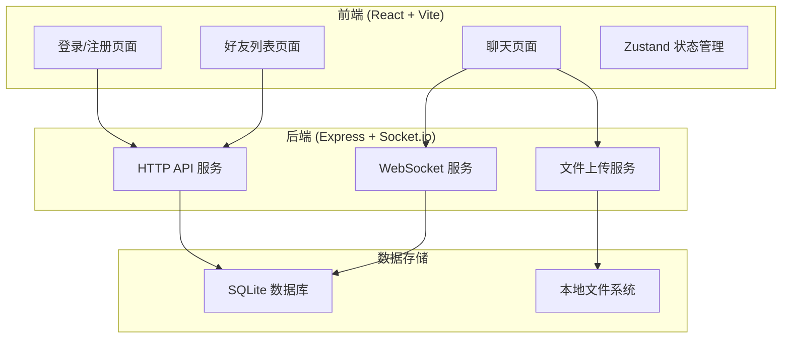
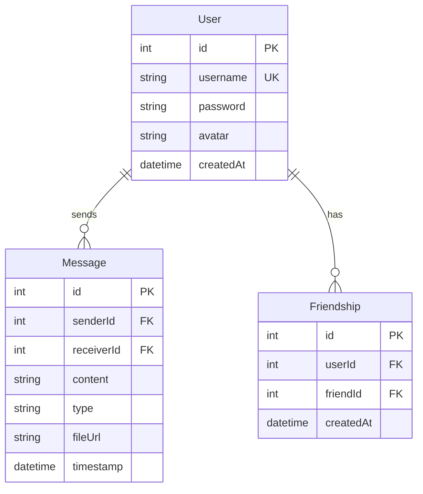

## 1. 架构设计



## 2. 技术说明

- **前端**：React@18 + TypeScript + Vite + Tailwind CSS + Zustand
- **初始化工具**：vite-init (react-express-ts 模板)
- **后端**：Express@4 + Socket.io (WebSocket 实时通信)
- **数据库**：SQLite (better-sqlite3)，轻量级无需额外服务
- **文件存储**：本地文件系统，使用 multer 处理上传

## 3. 路由定义

| 路由 | 页面 | 说明 |
|------|------|------|
| / | 登录页 | 用户登录 |
| /register | 注册页 | 用户注册 |
| /friends | 好友列表 | 好友管理和列表 |
| /chat/:friendId | 聊天页 | 与特定好友的聊天 |

## 4. API 定义

### 4.1 认证接口
```
POST /api/auth/register
  请求: { username: string, password: string }
  响应: { success: boolean, user: { id, username } }

POST /api/auth/login
  请求: { username: string, password: string }
  响应: { success: boolean, user: { id, username, token } }
```

### 4.2 好友接口
```
GET /api/friends
  请求头: Authorization: Bearer <token>
  响应: { friends: [{ id, username, avatar, online }] }

POST /api/friends/add
  请求头: Authorization: Bearer <token>
  请求: { username: string }
  响应: { success: boolean, friend: { id, username } }
```

### 4.3 消息接口
```
GET /api/messages/:friendId
  请求头: Authorization: Bearer <token>
  响应: { messages: [{ id, senderId, content, type, fileUrl, timestamp }] }
```

### 4.4 文件上传接口
```
POST /api/upload
  请求: multipart/form-data (file)
  响应: { success: boolean, url: string }
```

## 5. WebSocket 事件定义

| 事件名 | 方向 | 说明 |
|--------|------|------|
| send_message | 客户端→服务端 | 发送消息，包含 { receiverId, content, type, fileUrl? } |
| new_message | 服务端→客户端 | 接收到新消息，包含 { id, senderId, content, type, fileUrl, timestamp } |
| user_online | 服务端→客户端 | 好友上线通知 |
| user_offline | 服务端→客户端 | 好友离线通知 |
| typing | 客户端→服务端 | 正在输入状态 |
| typing_status | 服务端→客户端 | 好友正在输入状态 |

## 6. 数据模型

### 6.1 ER 图



### 6.2 数据定义语言 (DDL)

```sql
CREATE TABLE users (
  id INTEGER PRIMARY KEY AUTOINCREMENT,
  username TEXT UNIQUE NOT NULL,
  password TEXT NOT NULL,
  avatar TEXT DEFAULT '',
  createdAt DATETIME DEFAULT CURRENT_TIMESTAMP
);

CREATE TABLE messages (
  id INTEGER PRIMARY KEY AUTOINCREMENT,
  senderId INTEGER NOT NULL,
  receiverId INTEGER NOT NULL,
  content TEXT DEFAULT '',
  type TEXT DEFAULT 'text',
  fileUrl TEXT DEFAULT '',
  timestamp DATETIME DEFAULT CURRENT_TIMESTAMP,
  FOREIGN KEY (senderId) REFERENCES users(id),
  FOREIGN KEY (receiverId) REFERENCES users(id)
);

CREATE TABLE friendships (
  id INTEGER PRIMARY KEY AUTOINCREMENT,
  userId INTEGER NOT NULL,
  friendId INTEGER NOT NULL,
  createdAt DATETIME DEFAULT CURRENT_TIMESTAMP,
  FOREIGN KEY (userId) REFERENCES users(id),
  FOREIGN KEY (friendId) REFERENCES users(id),
  UNIQUE(userId, friendId)
);

-- 初始索引
CREATE INDEX idx_messages_sender ON messages(senderId);
CREATE INDEX idx_messages_receiver ON messages(receiverId);
CREATE INDEX idx_friendships_user ON friendships(userId);
```